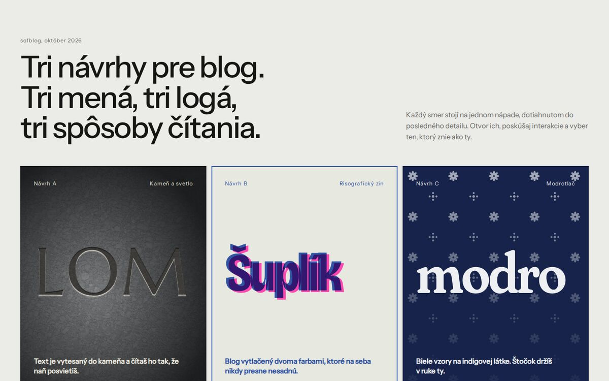
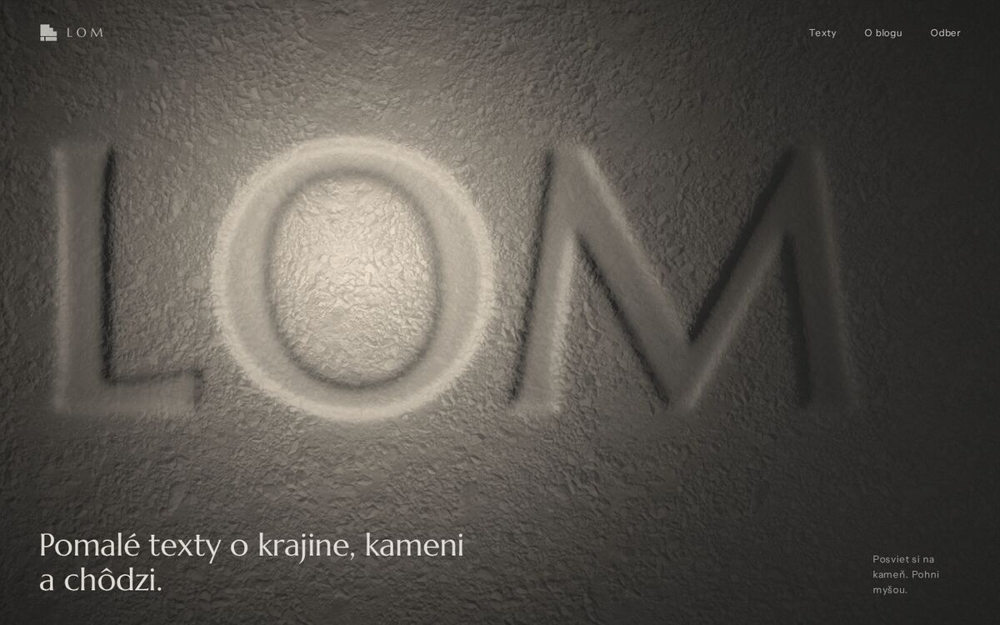
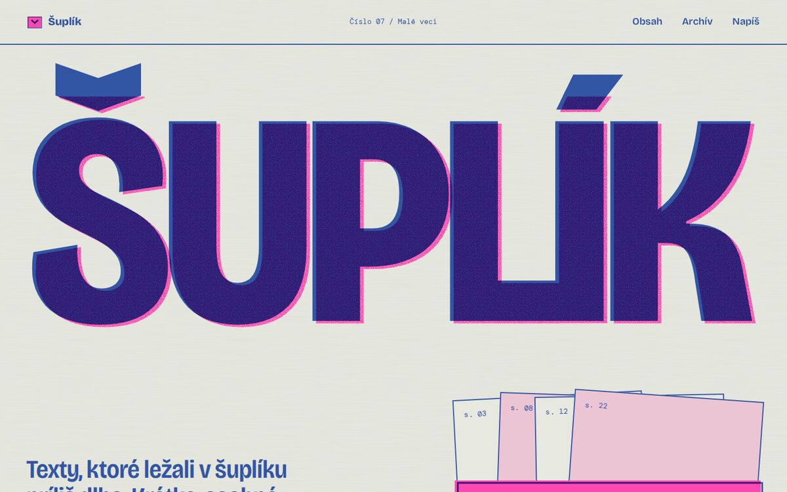
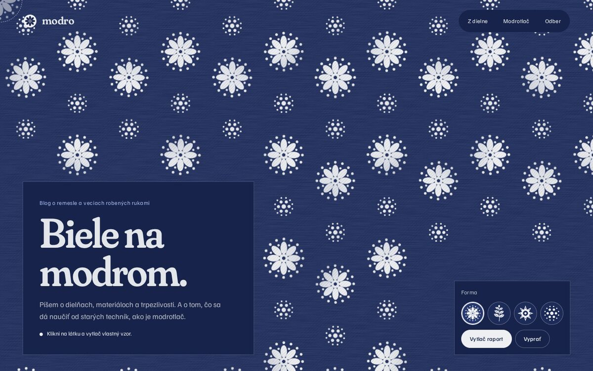

# sofblog — tri návrhy blogu

Tri samostatné dizajnové smery. Každý má vlastný názov, logo, typografiu, paletu a jednu signature interakciu. Všetko je statické HTML/CSS/JS bez build kroku.



## Spustenie

```bash
npx http-server -p 8080 .    # alebo: python3 -m http.server 8080
```

Potom otvor `http://localhost:8080/`. Rozcestník vedie na všetky tri návrhy. Každý návrh má domovskú stránku (`index.html`) a ukážku článku (`clanok.html`).

## A — LOM (kameň a svetlo)

> Text je vytesaný do kameňa a čítaš ho tak, že naň posvietiš.



- **Logo:** profil lomovej steny, tri terasy a jedna vrstevná škára.
- **Signature:** WebGL shader nasvecuje fotografickú textúru kameňa (albedo + normálová mapa) a slovo LOM, vytesané podľa výškovej mapy vyrastrovanej z reálneho `<h1>`. Kurzor je lampáš a na dotykových zariadeniach sa svetlo ťahá prstom. Pri scrollovaní lampáš klesá a svetlo sa kĺže po povrchu.
- **Zoznam textov ako geologické vrstvy:** hrúbka vrstvy zodpovedá dĺžke čítania. Pri hoveri sa pod vrstvou odkryje kameň.
- **Písmo:** Marcellus + Instrument Sans. **Paleta:** bridlica, kameň, lišajník.
- Bez WebGL sa zobrazí CSS fallback s rovnakou textúrou.

## B — Šuplík (risografický zin)

> Blog vytlačený dvoma farbami, ktoré na seba nikdy presne nesadnú.



- **Logo:** čelo šuplíka, ktorého úchytka je mäkčeň zo Š. Modrá je tlačená mimo registra.
- **Signature:** rýchlosť scrollu (Lenis velocity) rozostupuje ružový a modrý tlačový beh. Keď sa zastavíš, farby sa vrátia späť do registra.
- **Šuplík s textami:** tlačidlo vytiahne náhodný text. Všetky ilustrácie sú živo rastrované halftony (dva rastre pod rôznym uhlom, ako na risografe).
- **Písmo:** Bricolage Grotesque (variabilná šírka) + DM Mono. **Farby:** Riso Fluorescent Pink a Medium Blue na sivozelenom papieri.

## C — modro (modrotlač)

> Biele vzory na indigovej látke. Štočok držíš v ruke ty.



- **Logo:** tvár tlačiarenskej formy, z ktorej je vyrezaná osemlistá ružica.
- **Signature:** kurzor je štočok. Klikaním alebo ťahaním tlačíš na látku biele vzory (4 formy), pričom každý odtlačok má vlastné chyby ručnej tlače: nerovnomerný tlak a miesta, kde sa rezerva nechytila. Pri načítaní sa vytlačí raport, ktorý obchádza textový štítok.
- **Každý článok má vlastný vzor,** deterministicky vygenerovaný z jeho názvu.
- **Horizontálna sekcia** so štyrmi krokmi modrotlače (na mobile vertikálna) a päta s logom vystrihnutým z potlačenej látky.
- **Písmo:** Fraunces (osi SOFT/WONK) + Familjen Grotesk. **Paleta:** indigo, vyprané indigo, biela.

## Technické poznámky

- Knižnice sú uložené lokálne vo `vendor/`: GSAP 3.13 (ScrollTrigger) a Lenis 1.3.
- Fonty sú self-hostované vo `fonts/` (Fontsource, SIL OFL), podmnožiny latin + latin-ext.
- Všetky stránky rešpektujú `prefers-reduced-motion`: Lenis sa nespustí, WebGL vyrenderuje jeden statický snímok a raport sa vytlačí naraz.
- Obsah je čitateľný aj bez JavaScriptu, žiadna animácia ho neskrýva.
- Formuláre na odber sú len ukážka (validujú, ale nič neodosielajú).

## Licencie a zdroje

- Textúra kameňa (`lom/assets/stone-*.jpg`): `rockyGround` z [Babylon.js Assets](https://github.com/BabylonJS/Assets), licencia [CC BY 4.0](https://creativecommons.org/licenses/by/4.0/). Zmenšená a prekomprimovaná.
- Fonty: Marcellus, Instrument Sans, Bricolage Grotesque, DM Mono, Fraunces, Familjen Grotesk (SIL Open Font License) cez [Fontsource](https://fontsource.org).
- GSAP (štandardná licencia GreenSock, zdarma), Lenis (MIT).
